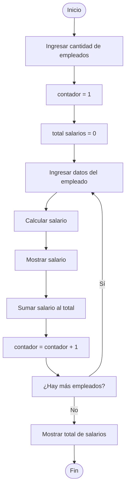

# Cálculo de ventas de cartones de leche por mes

## Descripción
El software tratará de una venta de leche. El pago será realizado a los empleados mediante la cantidad de cartones vendidos, teniendo en cuenta el total que se vendió en el mes.

El propósito de la tienda de leche es vender muchos cartones de leche, y cada uno tendrá una capacidad de **1.5 litros** (no es relevante para el cálculo, pero es necesario aclararlo).

- Precio por cartón: **$5.000**
- Inventario inicial: **200 cartones**
- Ejemplo:  
  - 10 cartones vendidos → **$50.000**
- Pago al empleado por cartón vendido: **$500**

---

## Historia de usuario

**Como:** Administrador  
**Quiero:** Ingresar el número de cartones de leche vendidos en el mes  
**Para:** Calcular el monto a pagar a los empleados teniendo en cuenta el total vendido en el mes y los cartones vendidos por cada empleado.

---

## Datos por empleado

La herramienta debe permitir ingresar los siguientes datos de cada empleado:

- Identificación
- Nombre
- Cartones vendidos
- Salario

**Fórmula del salario:**
Salario = Cantidad de cartones vendidos × Pago por cartón

La herramienta será sencilla de usar y no tendrá complicaciones técnicas.

---

## Criterios de aceptación

- El sistema permite ingresar **uno o más empleados**.
- Para cada empleado válido:
  - Se calcula el **salario individual correctamente**.
  - Se muestra el **valor calculado**.
- El sistema muestra el **total consolidado de salarios**.

---

## Curso de eventos

1. El coordinador ingresa la **cantidad de empleados** a procesar.

2. Para cada empleado:
   - El coordinador ingresa la **identificación**.
   - El coordinador ingresa el **nombre**.
   - El coordinador ingresa los **cartones vendidos en el mes**.
   - El coordinador ingresa el **pago por cartón**.
   - El coordinador ingresa el **salario**.
   - El software **almacena los datos ingresados**.

3. Una vez ingresados los datos, el sistema utiliza la fórmula para determinar el salario final:

4. El sistema **acumula cada resultado** como variable.

5. El sistema muestra en pantalla el **salario final de cada empleado**.

-- 

## Diagrama de flujo

